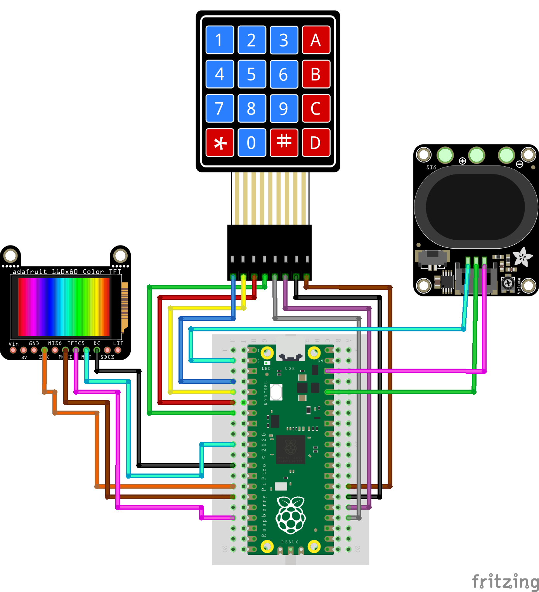
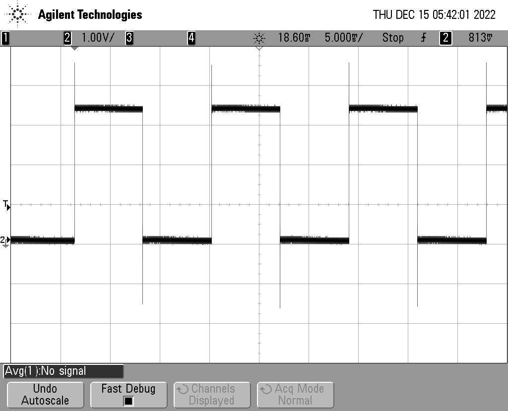
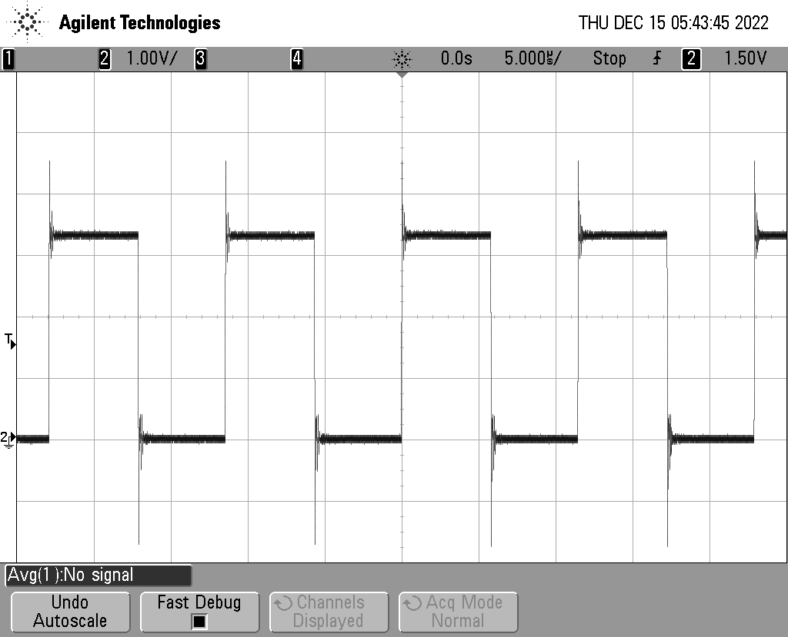
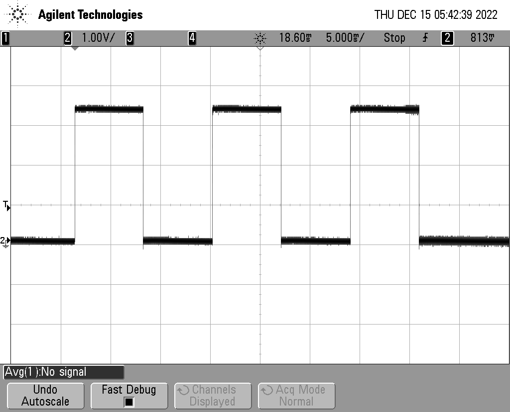
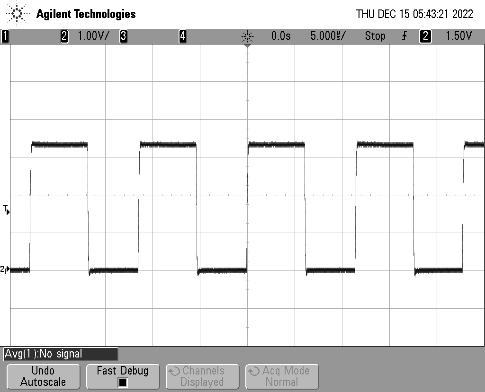

# ESE 519 Group Strawberry 🍑 
## Final Project Report

- Overview
- Design and Diagram
    - Wire Connection and Ordered Parts
    - Function Design
    - Interaction Design
- Technical Point Highlight
    - PIO
    - Flash memory
    - Multicore function
    - PWM signal generating
    - Hardware Diver
- Functions and Implementation
    - PWM Function
    - Free Mode function
    - Predefined Play Function
    - Load Function
    - Game Display Function
    - Game Score Function
    - Input Function
    - Display Function
- Main Problems and Solutions
    - Background Music
    - Sample
    - PWM Signal Noise
    - Storage
- Demo

## Overview

Music Game enjoys great popularity among people. Here, based on the portability and convenience of the microcontroller, along with the multiple functions provided by Raspberry SDK, a simple but funny music game could be developed on Raspberry Pi with few reasonable-priced accessories. In this project, we design and implement a Raspberry Pi Pico-based music game with a cheap keypad and amplifier.

In the following chapters, we will first introduce the project as a whole and gradually go into more and more detail about the techniques we deployed and the functions we implemented. Moreover, a short demo of our music game will be shown at the end of this page.

## Design and Diagram

In our initial proposal, the music game we design is similar to those on iPad or PC, for example, Deemo and Cytus. The game rules for these games are clear and easy, while it is hard to play with under the rule: choose the corresponding musical block with music playing in the background. Thus, we would like to show the game panel on the LCD screen on the Pico4ML chips from Arducam while playing music with a speaker connected to the chip. Besides being inspired by the MIDI instruments, we would also like to integrate the digital instrumental function into the program, combining both musical games and digital instruments. Definitely good news for music lovers, including us.

To make a music game/ instrument, we use the Pico4ML microcontroller as the core unit.  It would serve as the game's primary host and the digital instrument's center.

To play music, we connect an Adafruit STEMMA speaker to Pico4ML, which has a built-in D-class amplifier.

To receive input from the user, we wire up a ZRX 543 keypad.

We use a capacitor to realize a low-pass filter to filter out the PWM signal's high-frequency noise. Even though there may be some energy loss after the filter, the built-in amplifier in the speaker could still make the sound loud enough.

Here is the Design graph of the whole circuit.

## Technical Point Highlight

After designing all functions and basically deciding the hardware composition of our project, some fundamental techniques would be used to realize all these designs and proposals into reality functions and codes.

- PIO

  Since the requirement of this project is to use PIO modules as one of these critical features, we decide to use PIO modules to implement the PWM modules. The reason why we used the PIO modules to implement the PWM function rather than other functions is straightforward and simple:  most I/O functions would be using the PWM modules as vehicles.  PIO, an independent hardware module on RP2040, would be much more efficient when compared with GPIO to control the I/O stream. Music play and instrumental sound generation would be possible using the PIO module without initializing and utilizing more GPIO functions. The responsibility of the PIO PWM module, based on our function design and proposal, would be generating the PWM signal to convey our predefined music in game mode and play specific music notes in digital instrument mode.

- Flash memory

  Only playing impromptu music is not that exciting. What people really like is long-standing memory. Thus, with the need to store impromptu music playing under the instrument mode, we need to find a storage medium to save these precious records.

  Several options are available to us: using an external storage medium, for example, an SD card, using the integrated memory, for example, the flash memory in RP2040, or saving data to another chip or connected PC. The shortcoming and advantages of these methods are obvious. Using an SD card is convenient, but it takes some extra budget, and more time should be put into the FAT32 driver for SD cards. Using the built-in flash memory would be easy to implement and completely at no cost, while the storage space is strictly limited. Saving data to an external device is also of no cost while also having few limitations of amounts of space, but not profitable.

  The last decision is to use flash memory as the storage medium, which is of no cost. Since the audio data is not as large as images and video, the storage space limitation is not that severe.

- Multicore function

  Considering the essence of the music game is the music played in the background, we would like to play the music when interacting with gamers in the game. Fortunately, RP2040 has two cores, which means it can handle two tasks at the same time. We adopt the multicore function in the SDK and use two threads to implement our music game.

- PWM signal generating

  The most basic function would be sound generating. Here, the most popular function to deliver the sound to a speaker would be using a PWM signal. Different duty ratios and different frequencies of the PWM signal would make different sounds. We adopt two different methods to play different sounds for this project's two modes.

  For the music game mode, we utilized the PWM module at a fixed clock and period while setting different duty ratios for different data. For the free-playing instrumental mode, we change both the period and clock but use the same half of the period as the duty ratio to generate seven notes.

- Hardware Diver

  To interact with gamers, we need to make sure the LCD screen on the Pico4ML chips works functionally, and the keypad as the input device also works well. For the LCD on Pico4ML, we find the driver from the manufacturer Arducam and integrate it into our program. For the driver of the keypad, we wrote a driver based on the GPIO of chips and the keypad function on our own.

## Functions and Implementation

Our device has four main functions: the Free Mode function, Predefined Play Function, Record & Load Function, and Game Function. To support each function, we designed and implemented several sub-modules to make sure they could run smoothly.

### Keypad Driver

The keypad in this project is ZRX-543. The theory behind the hardware of the keypad is the method used to identify which key is pressed. ZRX-543 keypad has eight pins, among which four pins are responsible for the four rows, and the rest four pins are responsible for the four columns of the keypad.  All eight pins are attached to 8 different GPIO pins on the RP2040 chip. To identify which key is pressed by the player, we first set all 4 GPIO corresponding to those pins responsible for the four rows on the keypad one by one. Once a GPIO pin responsible for a row is set to be high, the driver checks each GPIO pin responsible for the four columns. The index of the column, which is detected to be high in voltage, along with the index of the row, which is set to be high, would be used to identify the key pressed. For example, when the first row is set high, and the third column is detected to be high in voltage, that means key three is pressed since key three is at the intersection of the first row and the third column. Checking all four columns is done after setting the GPIO of the row to be high. This is polling in the hardware.

### Input Function

In this project, in order to sample and get the input from the keypad rather than from the keyboard, the original input function `getchar_timeout_us`, which gets input from the PC the RP2040 is connected to with time out setting, is overridden here to form a new function `get_key_timeout_us` which gets input from the keypad but also with time out setting.  Combined with the function defined in the driver for keypad `getKey` , `get_key_timeout_us` would keep getting the input from the keypad within a time period by looping and jumping out the loop when the time is up with API `time_reached` or a valid input arrives. The default value returned by this function is a single char `m` if there is no valid input during the timeout time period. Otherwise, the input from the keypad would be returned.

### Free Mode Function

The primary function follows: the user clicks the keypad number from `1` to `7`. It gives the corresponding music `Do` to `Ti`. When a player wants to quit this mode, the user can click `#` so he/she can exit this mode and return to the mode selection page. We also encapsulate the all process into a simple `play_a_note` function, which takes the keypad number and plays a given note for further usage.

To realize the Free Mode Function, we utilize the PWM module written in PIO to generate the specific frequency. Besides that, we also have a keypad driver and sampling function to get the input stream from users. Since we transfer our input device from the keyboard on the PC to the keypad we add, we need to adapt the get_char function and delay function to the keypad to make a proper sample from the user.

The data flow is that:

1. the user clicks the keypad.

2. The circuit with the given row and column is connected, making the GPIO state changes.

3. With a driver, the PICO detects the signal change, and based on the change, we could program it and know which key the user clicks.

4. Calculate some parameters, including `clk_div`, `period`, and `Top` for PWM.

get_key_timeout_us

5. Pass these parameters to PWM and let it generates the square wave with a specific frequency.

### Predefined Play Function

As we mentioned, the Predefined Music Function plays the music we stored in the Pico4ML.  Here, we store short 4-second music in the device because of the limit of RAM.

To realize the Predefined Play Function, we first need to sample the WAV music and encode each sample point as an integer from [0, 249] since we set 250 as the TOP in this mode. Based on these sample points, we could pass these points as the input level one by one to the PWM to generate different waves.

### Record & Load Function

Playing predefined music is not enough. Having a recording and loading function is better so the user can DIY players’ songs.

To realize the Record & Load Function, we first need to sample the user input stream as a dynamic char array and then store it in the flash drive in Pico4ML using `flash_range_program` in `flash.h` lib. When we want to read these records, we could also use the dynamic char array to catch these chars, which will stop when encountering the string terminator. After we finish the loading job, we could map these chars to the given frequency. Thus, the `play_a_note` function could help us transfer the char to a music sound.

### Game Function

It would be a boring project without a game mode. To enter the game mode, the user can press `*` on the keypad and wait for the display changes. In the game, the player can press `1`, `2`, `3`, and `A`, which control different screen parts from left to right. The user needs to press the corresponding key to the fall-down brick to get a high score. After the game is over, the user can see his scores on the LCD screen.

The Game Function includes four parts:

1. The game display part
2. The game control part
3. The game score part
4. The game background music part

We import the LCD display driver from Arducam’s repository for the game display part.  And the game display is defined in the `display_games` function, with the x-axis position of the fallen bricks and the length of the bricks to be displayed in a game process as the input.  For each brick defined in the x-axis index array, we update the relative position measured by the moving speed defined in the file as a global variable.

Each time the position of a brick is updated on the screen, the function gets input from the keypad and tries to identify the correctness of the pressing from the player. This is the control part of the game. Judgment of the key pressing from gamers is conducted by the function `judge`, which takes the current brick’s x-axis position and y-axis position, key pressing reading result, falling speed of the bricks in the game, and the flag, as an indicator of the correctness of current brick so far, as the inputs. Each time when the position of the brick is updated, the `judge` function is called once to make a judgment of the current brick at the current position with current input from the gamer’s keypad. Considering the judgment, even though real-time, but still may not match the timing of the player’s pressing, two slack variables, `correct_range_upper` and `correct_range_bottom`, are set in order to leave sufficient space for `judge` function to make correct judgments. When the timing of the correct pressing from the player falls in the correct range defined between `correct_range_upper` and `correct_range_bottom`, a correct pressing would be identified. Otherwise, the pressing would be identified as wrong pressing. The function `judge` would return a judgment of the brick at its current position. The overall result would be the result of calling `judge` function once the positions of bricks are updated and accumulated.

When the game display ends, the final result will form, and the score based on the result will be calculated and shown on the LCD screen also by calling the function from the screen driver API.

During the game display period, pre-defined background music will be played until the player chooses to exit the game. Thus, two different tasks are to be handled during the game: display and music play. The multicore task API from SDK for RP2040 is used to address this problem. The music play function is undertaken by core 1 of RP2040 by using the API `multicore_launch_core1`. The music playing function would be passed as a parameter to the FIFO register for the multicore function using the API `multicore_fifo_push_blocking`. After passing the objective function as a parameter, the music play would start while the game would start at the same time.

## Main Problems and Solutions

During designing and implementing the program and making up the hardware connection, we met many problems. We solve most of them successfully with help from professors and TAs, also referring to the Internet. Here, we list a few of the problems that perplex us.

### Sample

How to sample the pressing of gamers, whether in the music game mode or digital instrument mode, is a big problem. In the initial version of our project, we used the keyboard as input and used the `getchar_timeout_us` function in `pico/stdio.h` . The timeout period would be used as the sample period. After switching from the keyboard to the keypad, we had to redesign the sampling method since no input function is built into the SDK for us to deploy for the keypad directly. As a solution, we override the original `getchar_timeout_us` function, which is called `get_key_timeout_us`, to receive input from the keypad while also having a time limit. We manually set the sample rate of pressing on the keyboard as four times per second by setting the timeout of the keypad input function to 250ms. Doing so could guarantee a stable sample of pressing while not using too much space to store the pressing samples in the flash memory when recording gamers’ own patterns.

### PWM Signal Noise

We could generate the sounds and send them to the speaker by utilizing the PWM PIO module. We found some apparent loss in the sound quality when listening to the speaker after the amplifier.  By using the oscilloscope in Detkin Lab, we find out there is a very obvious overshooting at the beginning of each PWM signal period:

For both methods we deployed here, i.e., using different clocks and frequencies or using different duty ratios, the overshooting could not be negligible.

We got some advice from Professor Dalton about the loss in audio quality. According to Professor Dalton, a low pass filter would be helpful to filter out those high-frequency noises. With TA Bhagath Cheela, we can filter almost all those high-frequency noises by parallel connecting a 1 nF capacitance with the speaker and amplifier. The filter result is shown as follows:

### Storage Interrupt

When trying to store data in flash memory, we found out that after erasing the flash memory for a certain address range, we are still unable to write it. After checking the Internet, we found out that the interrupts from other read or write requests from the program between these two commands may make the saving or loading data impassible to finish or complete correctly.  Thus, we. add two system functions to avoid the impact from interrupts:

`save_and_disable_interrupts` and `restore_interrupts` . The first function is to disable any potential interrupts and store current situations in storage. The latter function is to recover from the disabled situation and resume normal work. We could then safely read or write flash memory between calling these two functions.

## Demo

### User Story and Work Flows

Clicking the open button and waiting for around 5 seconds, the user will see `Welcome A record, B Music, C Free, D Load, * Game, # Quit`. To enter different modes, the user needs to click the corresponding buttons.

1. Free Play Mode

   Users can enter the free play mode, click some buttons, and play some music notes. Users may first press the `C` button on the keypad and wait for the reaction of the LCD display. After about one second, the main page disappeared, and users could press the number from “1” to “7” to emit the sound of music notes from `Do` to `Ti`.  When users want to exit Free Play Mode and go back to the main page, I press “#” to exit. After waiting for one second, the display changes back to the original main page with “Welcome”.

2. Record and Replay Mode

   Users may want to record their own music and replay what they recorded. They shall first press `A` to enter the Record Mode. After the display changes, users can press the number from `1` to `7` and DIY their own song within the given time. When finishing, users could press `#` to exit the Record Mode and go back to the main page.

   Users can press `D` to get into the Replay Mode to listen to what they recorded before. I could hear the song immediately after users clicked the button, and after several times replaying, users could press `#` to `jump out of the Replay Mode or wait for some time and listen to my song one more time.

3. Predefined Music Mode

   Users may want to play the predefined music stored on the device. If so, users may first press `B` to enter Predefined Music Mode. After the display changes, the user can hear the predefined music playing several times. To exit the Predefined Music Mode, the user could press `#` when the music stops.

4. Game Mode

   Users may want to play the music game on the device. If so, users may first press `*` to enter the Game Mode. The LCD display will change and show the game page. The user could see the green brick falls down with different x positions. If the user clicks the button before the brick crosses the white line, the brick becomes red, meaning a failure. If the user clicks the button exactly when the brick crosses the white line, the brick becomes yellow, meaning a success. If the user misses the brick without clicking, the brick will not change colors.

   After completing the game, the display will show the user's total score. Each successful match will give 100 points. The fail or miss will not cause a deduction in the score.
